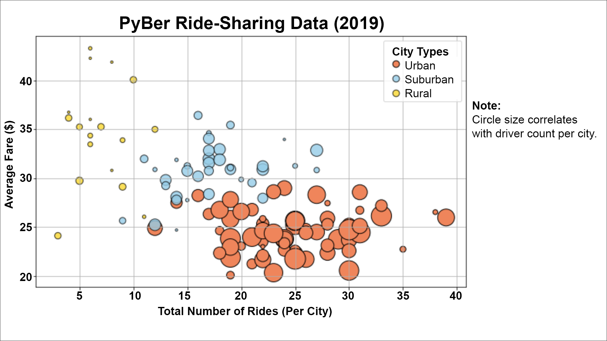
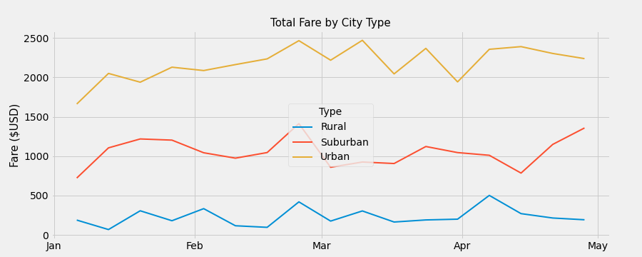

# PyBer_Analysis

## Overview of Project
The overall objective of the project is to explore the relationship between differnt city types and the corresponding financial outccome. By having sevearl comparable measures summarized for each city types, we will gain additional insight into our business and customer behavior. This will ensure the management can make more informed and strategic business decision that will bring more value to our customer and financial benefits to our business ownwer/shareholders.

## Results: 

Figure A: The bubble chart illustrate the key differences and correlations between different city types:
  1. In 2019, Urban city generally have more drivers than other city types (big bubbles), more rides (further right on the x-axis), but less average fair (lower on the y-axis).
  2. As we move along to 'less densely populated' cities are (Surburban & Rural), we can observe clear correlation with 'less' drivers and 'less' total riders, but exhibit negative correlation with average fare.

### Figure A

Figure B: The box plot reinforced the finding above - a positive correlation between the densely of the city types with the number of rides. Additionally, it also pointed to Urban cities having more spread, in turns of ride counts, between some city verses others.

### Figure B

Figure C: The pie chart illustrated who our main target customer were - 63% of sales from ride fares in 2019 were generated from Urban City type vs 30% from Suburban and 7% from Rural.

### Figure C

Figure D: Similarly to finding in Figure C, the pie chart indicated that Urban city generated most of our business activity in 2019, with more than twice as many rides coming from Urban city (68% of total rides) than Surburban (26%) and Rural (5%).

### Figure D

Figure E: The pie chart indicated that urban city contributed the majority of the driver pool (81% of all drivers).

### Figure E

Figure F: The lines chart showed the differece in seansonality between differnet city types. Between the month of January of April, all three city types experiences relatively lower actiivty (by total fares) as compare to the rest of the months. Suburban cities exhibited a clear increase in activity at the end of February and April.

### Figure F

## Conclusion:
Base on the facts shown and relationships illustrated, management can make the below strategic decision to potentially further increase total fares:

1. As shown in Fig 2, there are a big disparity of riding sharing popularity within the urban cities. Further analysis can be performed to identifed the reason for certain urban cities to be more successful than other urban cities that have similar population density. By making appropriate city-to-city adjustment, we can increase revenue from these less popular area, decrease the disparity within urban cities, and generate more total revenue as a whole.

2. As shown in Fig 1, rural and suburban cities have, in general, higher average fare and lower total rides than urban cities. Potential future exploratory discount on ride fare can be employed in selected area to determine the relative elasticity of demand for ride share for rural and suburban cities. If temporary decrease in average fare can be shown to have positive impact on ride count, with more revenue generated that can substainably offset additional cost on discount, than similar approaches can be permentantly implemented at these city locations. 

3. Given the current pricing structure, we can already observe some key seasonality trend in 2019. In future, managment can explore more favorable pricing program or marketing campaign can be impletmented to generate more rides and revenue from these less active month (like first two weeks of January). 

